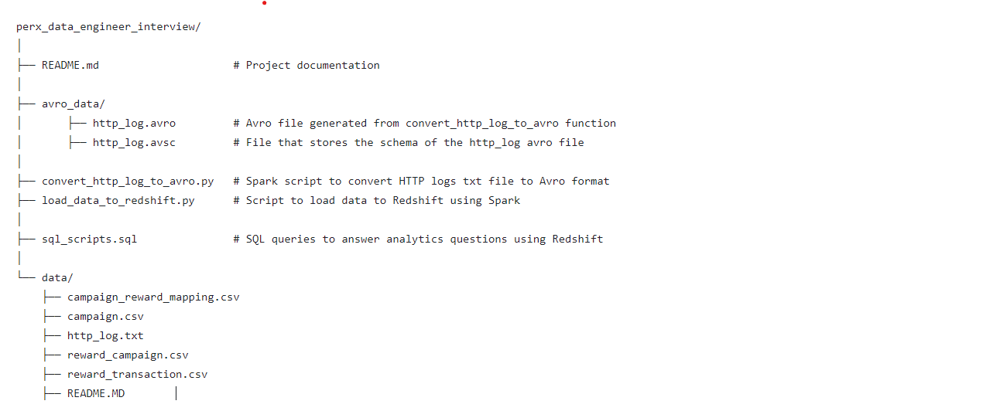
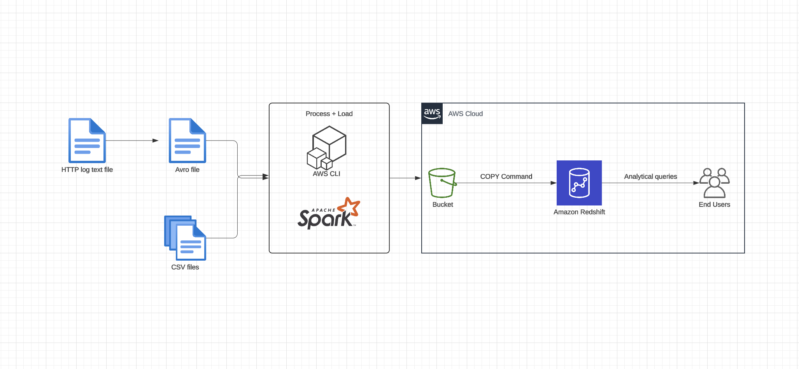

# Project structure

* Query results are captured in the images folder
# Load data to Redshift

## Introduction
This describes the best practice of a data processing pipeline that uses Apache Spark to process datasets and load them into Amazon Redshift via Amazon S3. This workflow is designed to efficiently handle big data using distributed processing with Spark and leverage Amazon Redshift for analytics and reporting.

## Prerequisites

- **Tools and Services**:
  - Apache Spark (version X.X)
  - Amazon S3
  - Amazon Redshift
  - AWS CLI

- **Configuration**:
  - **AWS Credentials**: Set up AWS credentials with necessary permissions for accessing S3 and Redshift.
  - **IAM Roles**: An IAM role with the required S3 and Redshift permissions, assigned to the Redshift cluster.
  - **Spark Session**: Apache Spark session configured to interact with S3.
  - **Redshift Cluster**: An existing Amazon Redshift cluster and database with the necessary table structures.
  - **S3 Buckets**: S3 buckets for storing input data and output results.

## Dataflow

## Alternative approaches:

- **spark-redshift package**: This workflow can also be done by using the spark-redshift package to load data that is being processed by Spark directly to Redshift without the needs of putting the data manually to S3 bucket. But behind the scence, this package will also put the data to a temp S3 bucket and then execute the COPY command to Redshift -> basically the same but manually puting objects to S3 has better flexibility and monitoring. 

- **Spark write JDBC directly to Redshift**: This approach is a straight forward way of putting data processed by Spark to Redshift through JDBC, but this is not the most performant way and not the best practice when working with various data format (for example avro in this case since write JDBC does not support this directly)
